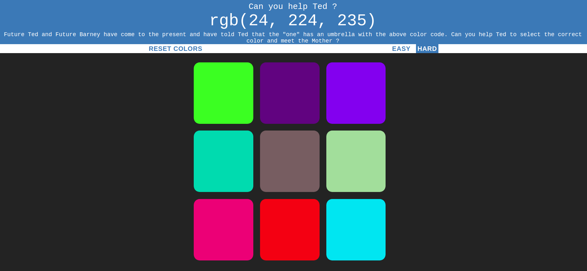

# Can you help Ted ?
Just a simple game I made to brush up basics of HTML, CSS, JS.This game is an attempt to make something similar to https://guessthecolor.com/.
## Background
**Future Ted** and **Future Barney** have come to the present and have told Ted that the "one" has an **umbrella** with the above color code. The objective is to help Ted to choose the correct color and to meet **the Mother**.
## Modifications
Barney Stinson voice effects have been added to avoid getting bored while playing this simple game.
## Screenshot

## Instructions
The game uses simple HTML,CSS ,JS. So ,no specific dependencies are present.
To play the game, just clone this repository in your local machine.

```git clone https://github.com/anmolagarwal999/RGB-Color-guessing-game```

Then you can just open the HTML file in your browser and start playing.


